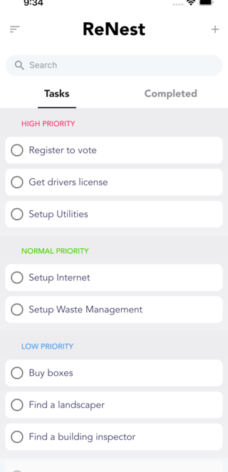

<h1 align="center">Welcome to ReNest 👋</h1>
<p>
  
</p>

> Making moving to a new place easy.
> 
> 
> 

# Core Features
>   * Getx State Management (dependency injection / MVC).
>   * Ability to Complete and unComplete Tasks.
>   * Search Tasks.
>   * Add new tasks (from static list for now).
>   * View Current tasks by priority or completed task list.

# Architectural Notes
>   * Unit Test Coverage at 90%.
>   * Test show examples of testing with each test category (controller, model, and widgets).
>   * Models use Build_value, Json_annotation, and Json_Serializable to automate model generation.

## Potential Improvements
>   * Unit Tests more separated. 
      > (mock controllers ect, make it so only one thing is being tested at a time.)
>   * Delete Tasks
>   * Add Custom Tasks
>   * Store tasks on server or locally.


## Run tests

```sh
flutter test
```

## Author

👤 **Caleb Maccarone**

* Website: www.qevka.com
* Github: [@qevka](https://github.com/qevka)
* LinkedIn: [@maccarone](https://linkedin.com/in/maccarone)

## 🤝 Contributing

Contributions, issues and feature requests are welcome!<br />Feel free to check [issues page](https://github.com/qevka/ReNest/issues). 

## Show your support

Give a ⭐️ if this project helped you!
